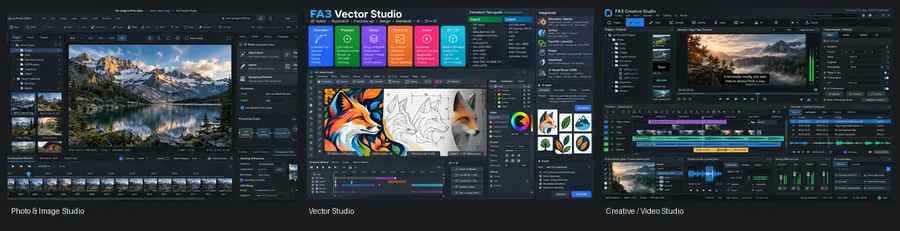
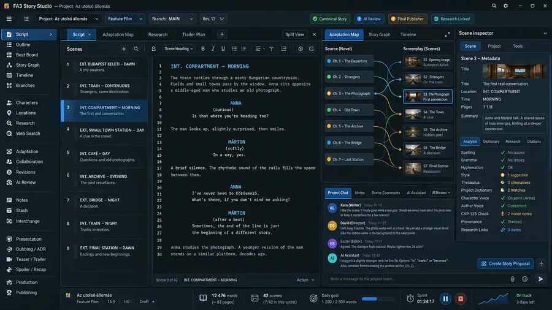
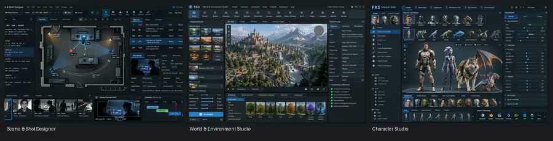
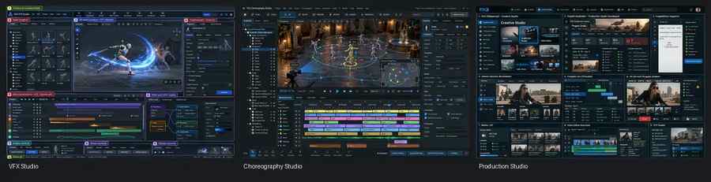
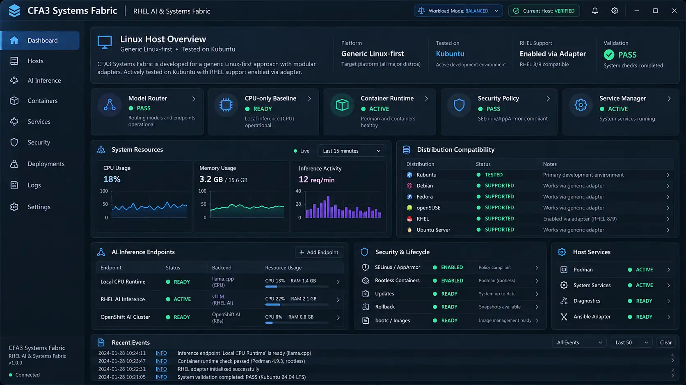
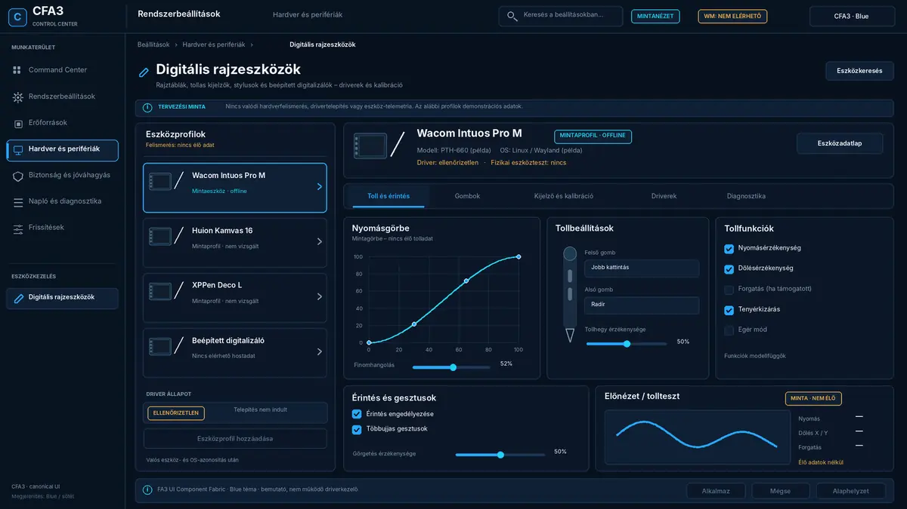
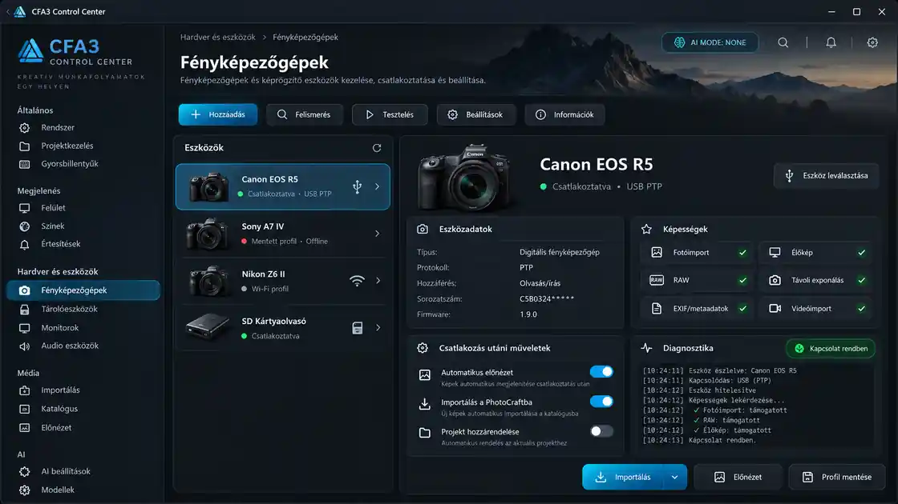

<div align="center">

# CFA3 — Cinema Fund Architectura 3

### An integrated, local-first creative-production, AI and advanced-computing platform — in development

**Photo · Video · Story · Vector · 3D · VFX · Animation · Audio · Production · AI**

**The complete production platform is being built; it is not yet finished.**


<sub>Creative Studio — design preview from the preceding FA3/CFA3 project, retained as an illustration of the intended product</sub>

</div>

---

## What is CFA3?

**CFA3 (Cinema Fund Architectura 3; previously FA3 / Final Architecture v3.0)** is a unified platform **being developed** for creative applications, AI-assisted tools, production workflows, collaboration and the infrastructure behind them.

The objective remains **substantially the same as the preceding project**: professional applications and production functions should work together in one consistent environment, rather than requiring users to assemble and manage unrelated programs, engines, models, projects and hardware backends.

The new repository represents a **clean implementation of that same product vision**. Its purpose is to eliminate accumulated technical errors, unnecessary duplicate applications, conflicting configuration and unjustified parallel implementations — **not** to discard useful capabilities, supported formats, legitimate alternative engines, or previously collected technical knowledge.

CFA3 is designed to be **local-first, provider-neutral, modular, interoperable and hardware-portable**. A CPU-only platform baseline is mandatory; compatible accelerators are discovered and authorized rather than assuming a particular vendor or fixed machine.

> **Development status:** everything described here is the **intended product and development scope**, except where an item is explicitly marked as implemented and verified. Concept images are design previews, **not** screenshots or proof of functioning software. The common Foundation, the full 200-capability inventory, application implementations, target operating-system qualifications and physical Current Host evidence are **not yet complete**.

---

# Applications

CFA3 is organized around focused user-facing applications rather than exposing the collection of engines, providers and runtimes working behind them.

## Create & edit

These are the intended capabilities and integrated application areas, **not a claim that the listed software has already been implemented or certified**.

### Photo & Image Studio

A unified image workflow for photography, RAW development, painting, compositing, retouching and frame/sequence work. Capability areas include non-destructive editing, masks/layers, color, panorama/HDR, restoration, sequence retouching, asset management and AI-assisted image operations.

### Video & Creative Studio

The CFA3 video workflow is centered on the **CFA3 Video Editor**, with its own project/timeline model and handoff to captions, audio, VFX, color, review and 3D/DCC workflows. **QuickClip** is planned as a fast-edit workflow within the unified editorial experience, handing projects back to the main editing model rather than requiring an unnecessary duplicate application.

### Vector Studio

A Qt 6-based vector workspace for professional drawing, typography, path editing, illustration, reusable geometry and AI-assisted vector workflows, with broad professional interchange as a design goal.

<p align="center">
  
  <br><sub>Photo & Image Studio · Vector Studio · Creative / Video Studio — interface design previews</sub>
</p>

### 3D & Animation Studio

The integrated 3D and animation workflow covers modeling, scene assembly, rigging, motion, rendering, procedural assets and interchange with film, set design, character work and editorial. Distinct production engines can coexist where they provide justified capabilities; reusable functionality belongs in shared CFA3 components rather than duplicate applications.

## Story / Screenplay Studio

CFA3 treats screenplay work as a production system rather than a generic text editor. The Story/Screenplay fabric is designed for production-type-aware documents, branching story continuations, revisions, research, adaptation mapping, scene metadata, writing goals/statistics, production handoff and human-reviewed AI assistance.

The document model is intended to support feature films, television, episodic production, advertising/commercials, live production and future profiles instead of assuming one universal screenplay structure.

<p align="center">
  
  <br><sub>CFA3 Story / Screenplay Studio — interface design preview</sub>
</p>

# Pre-production & world building

### Scene / Shot Designer

Shot planning, staging, cameras, actors, blocking, scene geometry and production-oriented previsualization share the same project context as the rest of the studio.

### World & Environment Studio

Environment design covers natural, architectural, historical and fictional settings — from rooms, streets, forests and oceans to historical periods, fantasy worlds, science-fiction environments and mixed settings.

### Character Studio

Character development connects visual design with 3D-ready character data, rig/pose/motion concepts and production assets rather than ending at a static image.

<p align="center">
  
  <br><sub>Scene / Shot Designer · World & Environment Studio · Character Studio — interface design previews</sub>
</p>

# Performance, VFX & production

### Choreography Studio

A spatial and temporal planning surface for performers, movement, blocking, timing, camera relationships and animation/production handoff.

### VFX Studio

A production-oriented effects workspace connecting compositing, node/graph workflows, particles, materials, procedural work, image/video assets and 3D interchange.

### Production Studio

The broader production surface ties together story, planning, assets, shots, editorial, review, delivery and supporting automation.

<p align="center">
  
  <br><sub>VFX Studio · Choreography Studio · Production Studio — interface design previews</sub>
</p>

Other focused CFA3 surfaces include **Subtitle Studio**, **Narration Studio**, audio/music and voice workflows, animation/character motion, live/broadcast workflows, review, credits/titles, spatial/reconstruction workflows and the CFA3 Control Center.

---


> **Concept artwork:** the five images in this README are preserved historical FA3/CFA3 design previews. They describe product direction only. Actual CFA3 GUI applications are planned around **Qt 6** and must pass tests both standalone and inside a genuine parent application when one exists. Historical artwork does not confer GUI PASS.

---

# One connected production workflow

A CFA3 project is intended to support a production journey such as the one below. **The diagram is illustrative, not a declaration that every possible application is coupled to every other application.** Actual exchanges occur only across registered, necessary handoff interfaces.


This is a **design model**. Rendering 3D into video does not make every 3D subsystem a video dependency. If audio is detached from video for separate editing, ownership and processing responsibility follow the actual asset handoff. Revisioned handoff contracts, receipts, rollback paths and change impact must be traceable. An unused or unrelated module must not acquire a synthetic dependency.

The applications share canonical project context and common platform authorities instead of independently rebuilding the same routing, hardware, AI and automation infrastructure.


---

# AI in CFA3

A **central Model Router** is intended to coordinate model and provider selection instead of permanently binding every application to one model or one vendor. Application requests, routing decisions, rights, model compatibility, user authorization and resource requirements remain separately governed.

The **Host Resource Broker (HRB)** owns resource placement and leases; the **Workload Mode Framework** coordinates workload modes and presents a global mode indication in GUI applications. Local, remote and hybrid providers may be supported where explicitly admitted. Neither cloud use nor GPU or CPU fallback may be silently substituted for the requested or proven execution path.

Shared functionality should be implemented centrally and used by applications through defined contracts. Qualified alternative native engines, GPU backends and independent providers can coexist; genuine alternatives are not to be erased as "duplicates."

---

# Operating systems and application availability

**Linux is the primary CFA3 platform. Some selected applications are also planned for Windows and Android.** This does **not** mean that the entire platform or every application will be available on every operating system.

| Target | Planned coverage | Release and verification status |
| --- | --- | --- |
| **Linux** | Primary CFA3 environment, shared platform and professional desktop applications | In development; not a complete platform release |
| **Windows** | Selected CFA3 applications, depending on application needs and supported dependencies | Planned per application; no blanket compatibility claim |
| **Android** | Selected CFA3 applications and mobile-appropriate workflows | Planned per application; no blanket compatibility claim |
| **Headless Linux** | Workflows and services that do not require a local GUI | Intended where technically justified; not blanket runtime admission |

For Linux desktops, portability through standard Linux/XDG interfaces is the design goal; Qt 6 desktop interfaces must not depend on a single Linux desktop shell where avoidable. Wayland is preferred where appropriate, with X11 requirements determined by actual supported targets. KDE Plasma, GNOME and other desktop environments are compatibility targets to be evaluated, **not** already certified across the product.

Each Windows or Android application must have its own platform support definition, installable package, supported feature matrix, native UI/interaction adaptations and relevant compatibility, security and GUI tests. Reduced or unavailable features must be made explicit. **Only tested releases may be described as available.**


### RHEL AI & Systems Fabric — Generic Linux-first (planned)

**CFA3 Systems Fabric** is a planned, modular Linux host-management and AI-infrastructure integration layer. **Generic Linux is the development target; Kubuntu is the primary development and testing environment**, not a mandatory runtime dependency. Debian, Fedora, openSUSE, RHEL and headless Linux remain validation targets rather than certified distributions.

Optional RHEL adapters will connect **Red Hat AI Inference, Podman, SELinux, Ansible, bootc and OpenShift AI** to CFA3's existing Model Router, Host Resource Broker, Workload Mode Framework and security authorities. CPU-only operation and functionality without Red Hat subscriptions must remain available.

<p align="center">
  
  <br><sub>Systems Fabric interface concept, not a screenshot of implemented software. All depicted status values, distribution support indicators and Current Host PASS/VERIFIED labels are illustrative, not test evidence.</sub>
</p>

---

# Hardware and compute portability

The intended CFA3 base is capability- and resource-based rather than tied to one workstation model.

| Component | CFA3 design requirement |
| --- | --- |
| **CPU** | Mandatory CPU-only platform baseline; detailed tested minimums remain to be established |
| **Accelerator / GPU / NPU** | Dynamically discovered **0..N** compatible devices; none mandatory for the platform base |
| **Backend vendors** | No global NVIDIA, AMD, Intel or CUDA lock-in |
| **Acceleration** | Qualified per function, actual hardware and a valid HRB authorization |
| **Fallback** | Recorded and policy-authorized; never a hidden substitute for required hardware PASS |
| **RAM / storage** | Workload- and application-specific requirements; no unverified universal minimum is claimed |
| **Safety** | Device-supported operating envelopes; no automatic unsafe tuning or hardware-policy bypass |

The old repository's machine specifications, hardware proofs and runtime PASS results **do not transfer** to this clean implementation. Target-specific accelerated functions remain unverified until they are actually tested.


## Digital Drawing Devices — Control Center design preview

CFA3 plans a central **Hardware & Peripherals → Digital Drawing Devices** panel for drawing tablets, pen displays, styluses and built-in digitizers. The design covers device detection, documented stable and OS-compatible driver selection, pressure/tilt controls, buttons, display mapping, calibration and diagnostics, with Linux support prioritized.

<p align="center">
  
  <br><sub>CFA3 Digital Drawing Devices — approved blue-theme GUI design preview</sub>
</p>

> **Design preview only.** This illustration does not verify live hardware detection, driver installation, GUI test passes or physical Current Host admission.


## Camera Connection & Device Manager — Control Center design preview

The planned CFA3 **Hardware & Devices → Cameras** panel provides a unified interface for connecting and configuring digital cameras and memory-card readers. Inspired by KDE's camera settings, it is designed for USB/PTP and supported network connections, device detection, connection tests, diagnostics, camera profiles, RAW and media import, and model-dependent live view or remote capture. Integration with PhotoCraft, FilmCraft and the shared Capture & Inbox/import services is planned.

<p align="center">
  
  <br><sub>CFA3 Camera Connection & Device Manager — GUI design preview</sub>
</p>

> **Design preview only.** The illustration does not verify device compatibility, hardware operation, remote-control support, Qt GUI test passes or physical Current Host qualification.


---

# Architecture at a glance

User-facing applications and application layers sit above shared CFA3 platform authorities:

```text
      User-facing CFA3 applications (Linux; selected Windows / Android)
 Photo · Video · Story · Vector · 3D · VFX · Animation · Audio · Production
                               │
                               ▼
        Common CFA3 Platform Foundation and SDK contracts
                               │
          ┌────────────────────┼─────────────────────┐
          ▼                    ▼                     ▼
     Model Router        Host Resource         Workload Mode
    (models/routes)      Broker (leases)        Framework (modes)
          │                    │                     │
          └────────────────────┼─────────────────────┘
                               ▼
        Shared engines / plugins / providers / runtimes
                               │
                               ▼
        Versioned evidence, real handoffs and qualification
```

**200 individually reconciled capabilities are the target for the new CFA3, not an already completed or validated registry.** The earlier FA3 baseline of 175 belongs to the historical repository and may inform source reconciliation but cannot serve as evidence of the new product.

The **Layer-Based Current Host** model is designed around a Platform Foundation unit, individual layer units and global evidence aggregation. Only actual component links and handoffs are tested; invented all-to-all couplings are not permitted. An application requiring a GUI must pass standalone testing and, when a real parent exists, actual integration testing with that parent.

For new native components CFA3 is **Rust-first**, with justified retention of other languages where needed for Qt 6, established engines, model runtimes or industry interoperability.

---

# Design principles

- **One coherent product:** maintain the original comprehensive creative/production vision without unnecessary independent products.
- **No needless duplication:** share common functionality and consolidate redundant applications; preserve justified engine alternatives.
- **Clean architecture:** do not inherit broken implementation, conflicting policies or obsolete settings from the old repository.
- **Local-first:** local work, privacy and ownership of projects remain first-class.
- **Provider-neutral:** applications consume admitted capabilities; providers are replaceable.
- **CPU-only is valid:** a GPU is not a global platform prerequisite.
- **Hardware-aware, not hardware-pinned:** actual hardware discovery and governed resource allocation.
- **Editable native projects:** preserve native/editable project data where the application owns it, alongside industry interchange.
- **Software coexistence:** do not require replacing or hijacking unrelated upstream installations.
- **Traceable AI and actions:** AI use must remain attributable and respect relevant approval boundaries.
- **Historical work preserved as reference:** reuse useful knowledge, data and design after verification, without importing old failures.
- **Source-first review:** check whether each external link was analyzed before; preserve valid earlier decisions and track verified updates, relocations or discontinuation.
- **Evidence remains factual:** plans, reference CI and design previews are never physical or production qualification PASS.

---

# Repository, current progress and validation

This is the **new CFA3 source repository**. It does not contain the finished platform. The historical source is [Final-Architecture-v3.0](https://github.com/ubuntuokos/Final-Architecture-v3.0); it exists as an **archival source of knowledge and design input**, not as the new runtime or canonical authority.

The current bootstrap effort provides initial development governance, a CPU-execution policy, source lifecycle checks and a small Rust contract workspace. **These are early development components; they do not complete the platform Foundation.**

| Area | Honest current status |
| --- | --- |
| CFA3 product vision and application overview | Documented design direction |
| Governance-first repository bootstrap | Under development/review |
| Full legacy-rule reconciliation | **PENDING** |
| Canonical target capability ledger (200) | **PENDING** |
| Complete shared Foundation and application suites | **NOT IMPLEMENTED** |
| Linux / Windows / Android product releases | **NOT RELEASED** |
| Qt 6 application GUI qualification | **NOT VERIFIED** |
| Physical Current Host qualification | **NOT VERIFIED** |
| Donor registry transfer and complete source identity index | **PENDING** |

Local **reference/structural** checks for the bootstrap branch include:

```bash
python3 scripts/check_bootstrap.py
python3 -m unittest discover -s tests -v
cargo test --workspace
```

A successful reference CI execution does **not** qualify any finished application, hardware backend, platform port or release. The source lifecycle lookup intentionally reports incomplete-index blockers until the preserved donor/source data has been reconciled.

Technical entry points:

- [Bootstrap scope and status](docs/BOOTSTRAP.md)
- [New CFA3 Foundation design baseline](docs/architecture/FOUNDATION-BASELINE.md)
- [Development governance reconciliation](docs/governance/RECONCILIATION.md)
- [Source lifecycle rules](docs/governance/SOURCE-LIFECYCLE.md)
- [Repository instructions](AGENTS.md)
- [Candidate canonical policies](canonical/policies/)

---

# License, rights and third-party technology

CFA3 aims to preserve clear boundaries between **CFA3-original work** and third-party software, models, datasets, assets, fonts, plugins, codecs and services. An available source repository is not automatically permission to modify or redistribute its contents. Licenses, ownership, provenance, patent/trademark concerns and applicable redistribution terms must be checked **before** actual incorporation.

The historical repository's license declarations and rights audits **are not automatically reissued as a license or a production-rights PASS for this new repository**. A definitive new-repository licensing and rights statement requires its own explicit adopted documents. Concept artwork here is preserved from the earlier CFA3 project for product illustration and carries no runtime/admission claim.

---

<div align="center">

## CFA3

**Create the work. Keep the project. Choose the compute. Preserve the evidence.**

**A unified production platform in development.**

</div>
